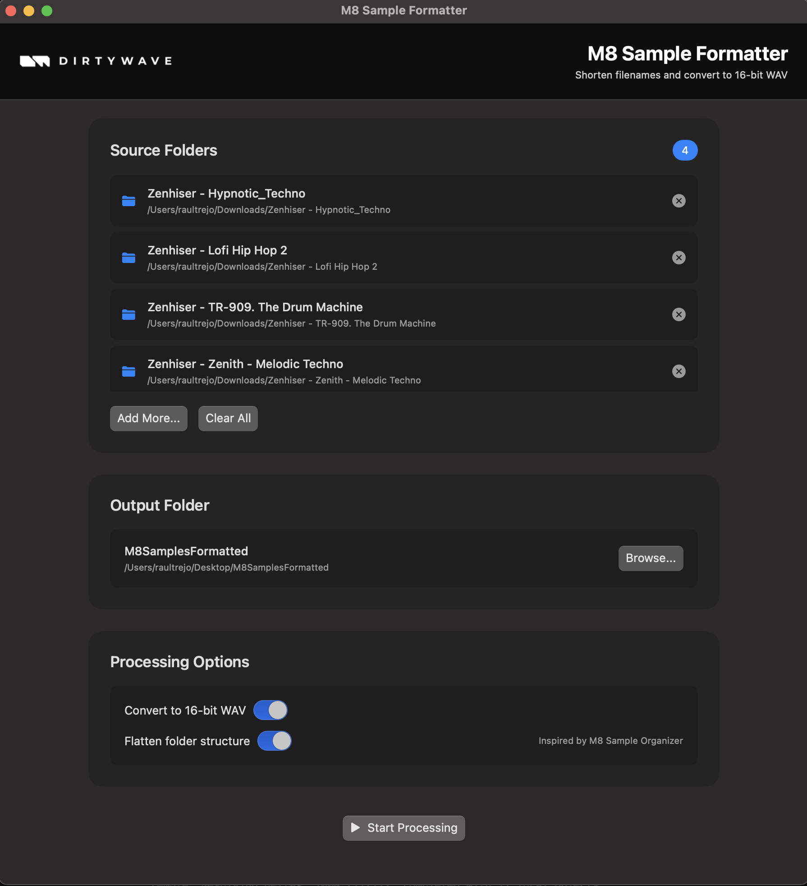

# 🎵 M8 Sample Formatter

**Fast audio sample pack formatter for the Dirtywave M8 tracker.**

[](https://www.apple.com/macos/)
[](https://www.apple.com/mac/)
[](LICENSE)

Intelligently shortens filenames, removes redundant words, and converts audio formats to M8-ready 16-bit WAV files. Inspired by [M8 Sample Organizer](https://github.com/birds-inc/m8-sample-organizer) with native macOS GUI and Apple Silicon optimization.

---

## ✨ Features

- **📁 Multi-Folder Selection** - Process multiple sample packs at once
- **✂️ Intelligent Name Shortening** - Hyphenated format preserves casing for M8 readability
- **🔄 Smart Duplicate Removal** - Fuzzy substring matching removes pack name duplicates
- **🏷️ Acronym Removal** - Automatically removes pack-specific prefixes (ESE-, NRE-, HL-, etc.)
- **🎯 Redundant Category Removal** - Removes category words already in folder path
- **🧹 Filler Word Cleanup** - Removes marketing words, years, WAV, SERUM, and more
- **📏 Path Length Management** - Keeps filenames under M8's 128-character limit
- **⚡ Always-On Abbreviations** - Drum→Drm, Vocal→Vox, Bass→Bs, etc.
- **🎵 Format Conversion** - Converts WAV, AIFF, FLAC, OGG, MP3 to 16-bit WAV
- **📂 Structure Preservation** - Maintains your folder organization
- **🗂️ Folder Flattening** - Optional folder structure flattening (inspired by M8 Sample Organizer)
- **⚡ Ultra Fast** - 200-300 files/second with multi-threading
- **🖥️ Native macOS UI** - Clean SwiftUI interface
- **🍎 Apple Silicon Optimized** - Uses Accelerate framework for vectorized operations

## 📸 Screenshot



*Clean, modern interface with Dirtywave branding and intuitive workflow for processing sample packs.*

---

## 🙏 Acknowledgments

This project was inspired by and builds upon the excellent work of the [M8 Sample Organizer](https://github.com/birds-inc/m8-sample-organizer) by [birds-inc](https://github.com/birds-inc). 

We extend our gratitude to the original developers for:
- **Folder flattening algorithm** - The core logic for reducing nested folder structures
- **Strike word removal** - The intelligent approach to removing redundant words
- **M8 optimization concepts** - Understanding the specific needs of M8 tracker users

Our implementation adds:
- **Native macOS GUI** - SwiftUI interface for better user experience
- **Apple Silicon optimization** - High-performance processing using Accelerate framework
- **Multi-threading** - Parallel processing for faster conversion
- **Real-time progress tracking** - Live updates during processing

Thank you to the M8 community and the original M8 Sample Organizer team for the inspiration and foundation! 🎵

---

## 📥 Installation

### Download Release (Recommended)

1. Go to the [Releases](https://github.com/rauldtrejo/M8SampleFormatter/releases) page
2. Download `M8SampleFormatter.dmg` from the latest release
3. Open the DMG file
4. Drag `M8SampleFormatter.app` to your Applications folder
5. Done!

### Build from Source

See [Building from Source](#-building-from-source) below.

---

## 🚀 Quick Start

1. **Launch** the application
2. **Click** "Add Folders..." and select your sample pack folders (⌘-click for multiple)
3. **Click** "Browse..." to select an output destination
4. **Click** "Start Processing"
5. **Done!** Your samples are ready for M8

---

## 📖 How It Works

### Input
```
Ghosthack - Ultimate Techno Bundle 2025/
├── Ghosthack - EDM Sound Effects/
│   ├── Miscellaneous/
│   │   └── Ghosthack-ESE_Misc_Kick_Ultimate.wav
│   └── Reverses/
│       └── ESE-Reverse-Breath.wav
└── Ghosthack - Drum Hero 4/
    └── Loops/
        └── DH4-Drum-Loop-Techno-155BPM.wav
```

### Output
```
Ghosthack-Melodic-Techno/
├── EDM-Sound-Effects/
│   ├── Miscellaneous/
│   │   └── Misc-Kick.wav
│   └── Reverses/
│       └── Breath.wav
└── Drm-Hero-4/
    └── Lps/
        └── Lp-155BPM.wav
```

### What Happened

**Removed:**
- Marketing words: `Ultimate`, `Bundle`, `2025`
- Pack name duplicates: `Ghosthack`, `Techno`
- Acronyms: `ESE-`, `DH4-`
- Category words: `Drum` (already in folder), `Loop` (already in folder)
- Filler words: `Ultimate`

**Abbreviated:**
- `Drum` → `Drm`, `Loops` → `Lps`

**Preserved:**
- Musical info: `155BPM`
- Meaningful content: `Breath`, `Kick`, `Misc`
- Folder structure and casing

### Folder Flattening (Optional)

When the "Flatten folder structure" option is enabled, nested folders are combined into a single flattened directory:

#### Input (Nested Structure)
```
Capsun - Lo-Fi Soul & Future Beats/
├── CPA_CAPSUN_Lo_Fi_Soul___Future_Beats/
│   └── Drums___Percussion/
│       └── Drum___Perc_One_Shots/
│           └── Snare/
│               └── CLF_Snare_Chunk.wav
```

#### Output (Flattened Structure)
```
output/
└── capsunLoFiSoulFutureBeats/
    └── CPA_CAPSUN_Lo_Fi_Soul___Future_Beats_Drums___Percussion_Drum___Perc_One_Shots_Snare/
        └── CLF_Snare_Chunk.wav
```

**Benefits of Flattening:**
- **Simplified Navigation** - No more deep folder hierarchies
- **Duplicate Word Removal** - Removes redundant words like "processed", "final", "version"
- **Filler Word Cleanup** - Removes common filler words like "sample", "sound", "audio"
- **M8-Friendly** - Easier to navigate on the M8 tracker's limited screen

---

## 🎯 Formatting Rules

M8 Sample Formatter applies intelligent strategies to create M8-compatible filenames under 128 characters:

### Processing Order:

1. **Parent folder cleanup** - Remove years (2020-2029), marketing words (`Ultimate`, `Bundle`, `Essentials`), content in `()` and `[]`
2. **Pack name removal** - Fuzzy matching removes pack name from all subfolders/filenames
3. **Acronym removal** - Remove 2-4 letter prefixes (`ESE-`, `DH4-`, `NRE-`, etc.)
4. **Category word removal** - Remove words already in folder path (`Kick` removed from `Kick-01.wav` if in `Kicks/` folder)
5. **Abbreviations** - Always applied (`Drum→Drm`, `Vocal→Vox`, `Loop→Lp`, `Bass→Bs`)
6. **Truncation** - Last resort if still too long (with warning)

### Examples:

| Original | Output | What Changed |
|----------|--------|--------------|
| `Ghosthack-ESE_Misc_Kick_Ultimate.wav` | `Misc-Kick.wav` | Removed: Ghosthack, ESE, Ultimate |
| `DH4-Drum-Loop-155BPM.wav` | `Lp-155BPM.wav` | Removed: DH4, Drum (in folder). Abbreviated: Loop→Lp |
| `KSHMR-Vocal-Loop-130.aiff` | `Vox-Lp-130.wav` | Removed: KSHMR. Abbreviated: Vocal→Vox, Loop→Lp. Converted to WAV |


## 📋 Quick Reference

### Common Abbreviations:
`Drum→Drm`, `Vocal→Vox`, `Loop→Lp`, `Bass→Bs`, `Percussion→Perc`, `Guitar→Gtr`, `String→Str`, `One-Shot→OS`, `Melody→Mel`, `Chord→Chd`

### Always Preserved:
Musical keys (`F#m`, `C#`), BPM (`155BPM`), numbers, original casing, meaningful content

### Always Removed:
Marketing words, years (2020-2029), pack name duplicates, acronyms (ESE-, DH4-), category words in folder path, content in `()` and `[]`

---

## 🏷️ Releases

### Creating a Release

1. **Tag a version**:
   ```bash
   git tag v1.0.0
   git push origin v1.0.0
   ```

2. **GitHub Actions will automatically**:
   - Build the application
   - Create a GitHub Release
   - Upload the DMG file
   - Make it available for download

### Manual Release (Alternative)

If you prefer to create releases manually:

1. Build the DMG locally: `./scripts/build_complete.sh`
2. Go to GitHub → Releases → Create a new release
3. Upload `dist/M8SampleFormatter.dmg` as an asset

---

## 🛠️ Building from Source

### Prerequisites

- **macOS 11.0+** (Big Sur or later)
- **Xcode Command Line Tools**: `xcode-select --install`
- **CMake 3.20+**: `brew install cmake`
- **pkg-config**: `brew install pkg-config`
- **libsndfile**: `brew install libsndfile`

### Build Instructions

```bash
# Clone the repository
git clone https://github.com/rauldtrejo/M8SampleFormatter.git
cd m8-sample-formatter/M8SampleFormatter_Complete

# Build everything (C++ backend, SwiftUI GUI, and DMG)
./scripts/build_complete.sh

# The DMG will be created in the dist/ folder
open dist/M8SampleFormatter.dmg
```

### Manual Build

If you want to build components separately:

```bash
# 1. Build C++ Backend
mkdir -p build && cd build
cmake ..
make -j$(sysctl -n hw.ncpu)
cd ..

# 2. Build SwiftUI GUI
swift build --package-path . -c release --product M8FormatterGUI

# 3. Create App Bundle
./scripts/build_app_bundle.sh

# 4. Create DMG (optional)
./scripts/create_simple_dmg.sh
```

### Build Output

- **`build/M8SampleFormatter`** - C++ backend executable
- **`.build/release/M8FormatterGUI`** - SwiftUI GUI executable
- **`M8SampleFormatter.app`** - macOS app bundle
- **`dist/M8SampleFormatter.dmg`** - DMG installer

---

## 🏗️ Project Structure

```
M8SampleFormatter_Complete/
├── src/
│   ├── cpp/                    # C++ Backend
│   │   ├── audio/             # Audio processing (libsndfile, Accelerate)
│   │   ├── filesystem/        # File operations, path management
│   │   ├── utils/             # Logger, ThreadPool
│   │   └── main.cpp           # Entry point
│   └── swift/                  # SwiftUI Frontend
│       └── M8FormatterGUI/
│           ├── ContentView.swift          # Main UI
│           ├── ProcessingViewModel.swift  # State management
│           ├── M8FormatterBackend.swift   # C++ bridge
│           └── main.swift                 # App entry
├── scripts/
│   ├── build_complete.sh      # Master build script
│   ├── build_app_bundle.sh    # Create .app bundle
│   ├── create_simple_dmg.sh   # Create DMG installer
│   └── install_m8_formatter.sh # Installation helper
├── CMakeLists.txt             # C++ build configuration
├── Package.swift              # Swift package manifest
└── README.md                  # This file
```


## 🔧 Technical Details

**Tech Stack:** C++17, libsndfile, Apple Accelerate, SwiftUI, AppKit  
**Performance:** ~250 files/second on M1 MacBook Pro  
**Optimizations:** Multi-threading (2x CPU cores), vectorized operations, native ARM64

---

## 🤝 Contributing

Contributions welcome! See [Contributing Guidelines](CONTRIBUTING.md) for details.

Report issues: https://github.com/rauldtrejo/M8SampleFormatter/issues

---

**Made with ❤️ for the M8 community** | [Star on GitHub ⭐](https://github.com/rauldtrejo/M8SampleFormatter)

